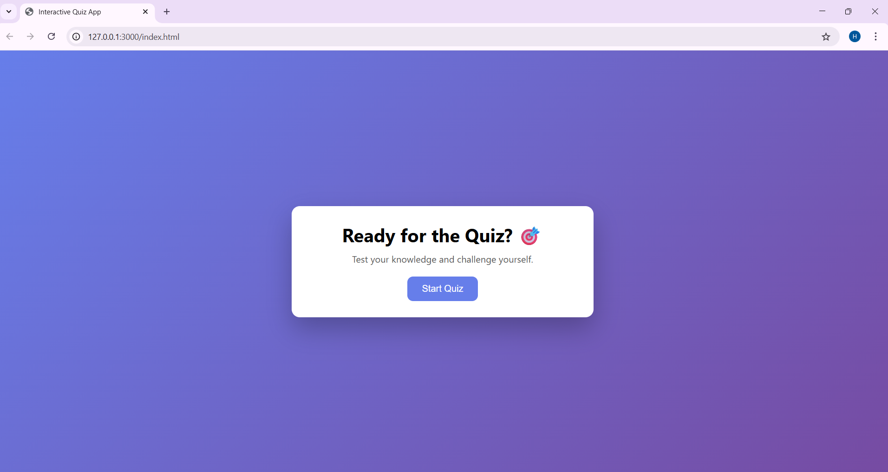
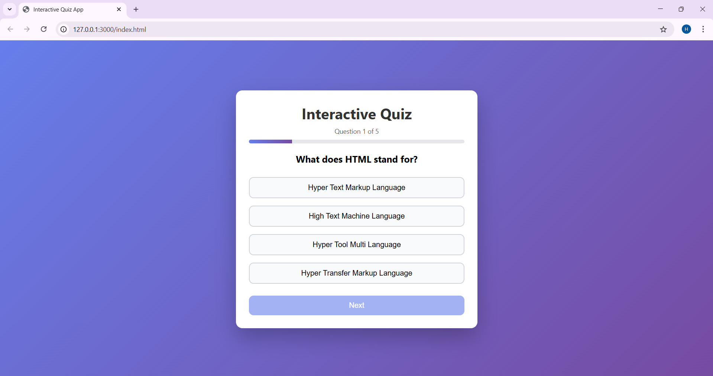
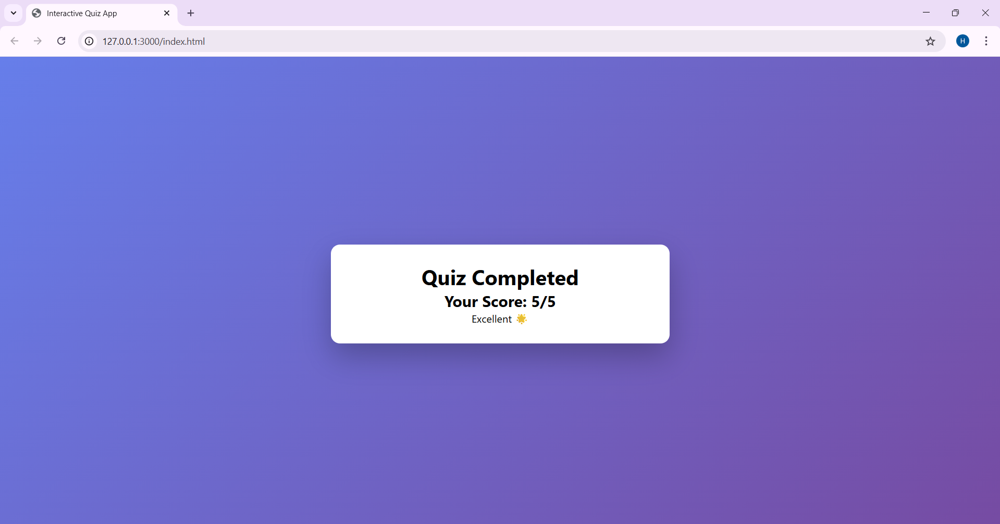

# Interactive Quiz Application

**Technologies Used:** HTML | CSS | JavaScript

## Description
This is an **Interactive Quiz Application** developed as part of the CodSoft Internship program.  
The quiz features a **start screen**, **multiple-choice questions**, a **progress tracker**, and a **dynamic score evaluation** with user-friendly messages.

## Features
- Start screen: *Ready for the Quiz?*  
- Multiple-choice questions (1 correct, 3 wrong options)  
- Progress bar: shows current question out of total  
- Dynamic score calculation  
- Final result with encouraging messages  
- Responsive design for mobile and desktop

## How to Use
1. Open `index.html` in your browser  
2. Read each question carefully  
3. Click on the correct option and then **Next**  
4. At the end, see your **score and result message**  

## Screenshots

### Home Page

### Question Page

### Result Page

## License
This project is developed for **CodSoft Internship**. Feel free to use it as a reference for learning purposes.
